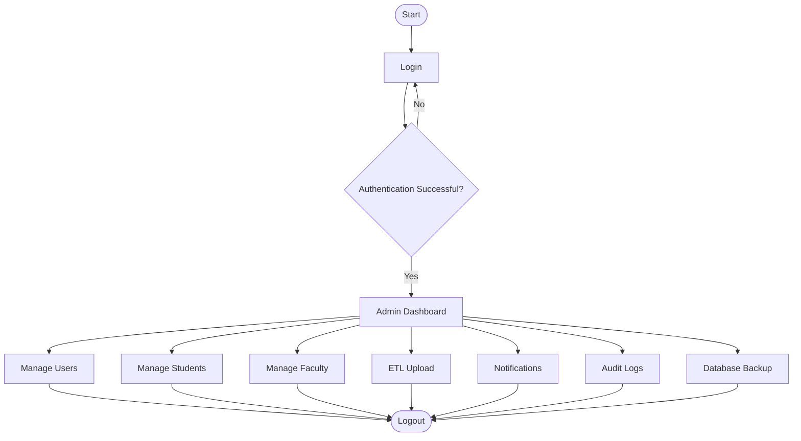

```mermaid
flowchart TD

A([Start]) --> B[Login]

B --> C{Authentication Successful?}

C -- No --> B

C -- Yes --> D[Admin Dashboard]

D --> E[Manage Users]

D --> F[Manage Students]

D --> G[Manage Faculty]

D --> H[ETL Upload]

D --> I[Notifications]

D --> J[Audit Logs]

D --> K[Database Backup]

E --> L([Logout])

F --> L

G --> L

H --> L

I --> L

J --> L

K --> L
```