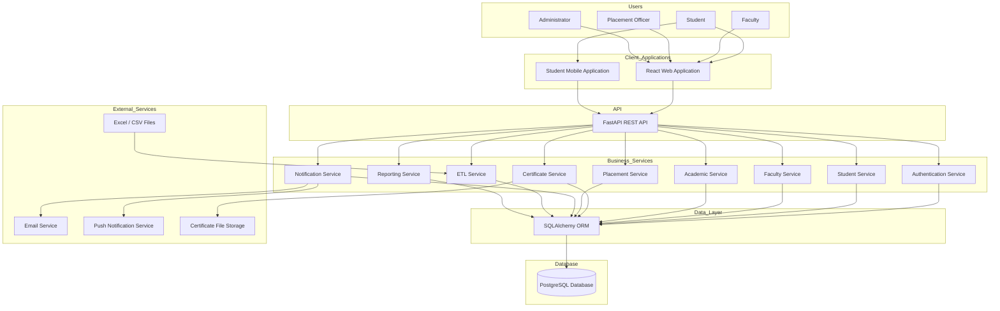

# Student Success Platform (SSP) - System Architecture

## Overview

The Student Success Platform (SSP) is a centralized web and mobile application that enables students, faculty, placement officers, and administrators to manage academic, administrative, and placement-related activities through a secure, scalable, and role-based platform.

---

## High-Level Architecture

---

## Architecture Layers

### 1. Users

- Student
- Faculty
- Placement Officer
- Administrator

---

### 2. Client Applications

- React Web Application
- Student Mobile Application

---

### 3. API Layer

- FastAPI REST API

---

### 4. Business Services

- Authentication Service
- Student Service
- Faculty Service
- Academic Service
- Certificate Service
- Placement Service
- Notification Service
- ETL Service
- Reporting Service

---

### 5. Data Layer

- SQLAlchemy ORM

---

### 6. Database

- PostgreSQL

---

### 7. External Services

- Excel / CSV Import
- Email Notifications
- Push Notifications
- Certificate Storage

---

## Technology Stack

| Layer | Technology |
|--------|------------|
| Frontend | React + Vite + Tailwind CSS |
| Mobile | React Native |
| Backend | FastAPI |
| ORM | SQLAlchemy |
| Database | PostgreSQL |
| Authentication | JWT |
| ETL | Pandas + OpenPyXL |
| Notifications | Email + Push |
| Reports | PDF / Excel |
| Version Control | Git & GitHub |

---

## Data Flow

1. User logs in through the web or mobile application.
2. The request is sent to the FastAPI backend.
3. Authentication and authorization are performed.
4. The appropriate business service processes the request.
5. SQLAlchemy communicates with PostgreSQL.
6. The response is returned to the client.
7. External services are used when required for notifications, file storage, and ETL imports.

---

## Future Enhancements

- Docker Deployment
- Nginx Reverse Proxy
- Redis Cache
- Background Jobs
- AI Prediction Engine
- Chatbot Assistant
- Parent Portal
- Multi-College Support