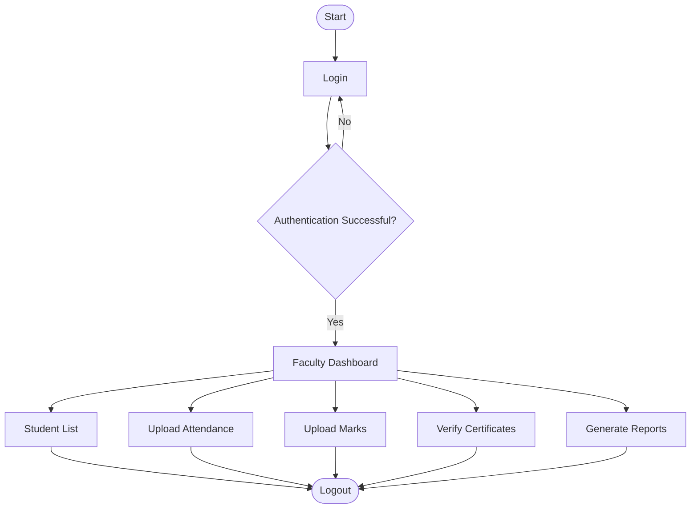

```mermaid
flowchart TD

A([Start]) --> B[Login]
B --> C{Authentication Successful?}

C -- No --> B

C -- Yes --> D[Faculty Dashboard]

D --> E[Student List]

D --> F[Upload Attendance]

D --> G[Upload Marks]

D --> H[Verify Certificates]

D --> I[Generate Reports]

E --> J([Logout])
F --> J
G --> J
H --> J
I --> J
```