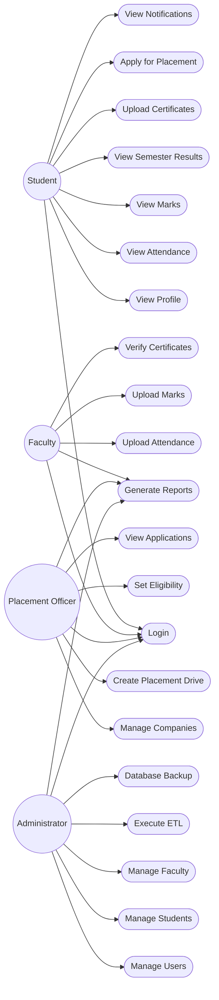

# Student Success Platform - Use Case Diagram

```mermaid
flowchart LR

Student((Student))
Faculty((Faculty))
Placement((Placement Officer))
Admin((Administrator))

Login([Login])

Profile([View Profile])
Attendance([View Attendance])
Marks([View Marks])
Results([View Semester Results])
Certificates([Upload Certificates])
PlacementApply([Apply for Placement])
Notifications([View Notifications])

UploadAttendance([Upload Attendance])
UploadMarks([Upload Marks])
VerifyCertificate([Verify Certificates])
Reports([Generate Reports])

Companies([Manage Companies])
Drives([Create Placement Drive])
Eligibility([Set Eligibility])
Applications([View Applications])

ManageUsers([Manage Users])
ManageStudents([Manage Students])
ManageFaculty([Manage Faculty])
ETL([Execute ETL])
Backup([Database Backup])

Student --> Login
Student --> Profile
Student --> Attendance
Student --> Marks
Student --> Results
Student --> Certificates
Student --> PlacementApply
Student --> Notifications

Faculty --> Login
Faculty --> UploadAttendance
Faculty --> UploadMarks
Faculty --> VerifyCertificate
Faculty --> Reports

Placement --> Login
Placement --> Companies
Placement --> Drives
Placement --> Eligibility
Placement --> Applications
Placement --> Reports

Admin --> Login
Admin --> ManageUsers
Admin --> ManageStudents
Admin --> ManageFaculty
Admin --> ETL
Admin --> Backup
Admin --> Reports
```