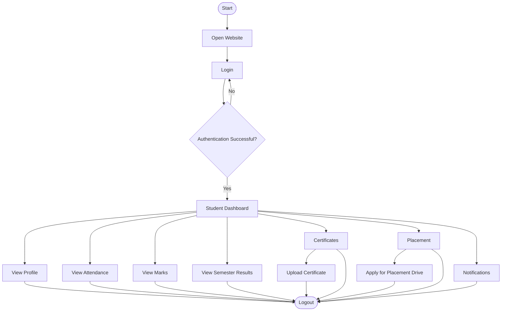

# Student Success Platform - User Flow

```mermaid
flowchart TD

A([Start]) --> B[Open Website]
B --> C[Login]
C --> D{Authentication Successful?}

D -- No --> C

D -- Yes --> E[Student Dashboard]

E --> F[View Profile]
E --> G[View Attendance]
E --> H[View Marks]
E --> I[View Semester Results]
E --> J[Certificates]
E --> K[Placement]
E --> L[Notifications]

J --> M[Upload Certificate]

K --> N[Apply for Placement Drive]

F --> O([Logout])
G --> O
H --> O
I --> O
J --> O
K --> O
L --> O
N --> O
M --> O
```